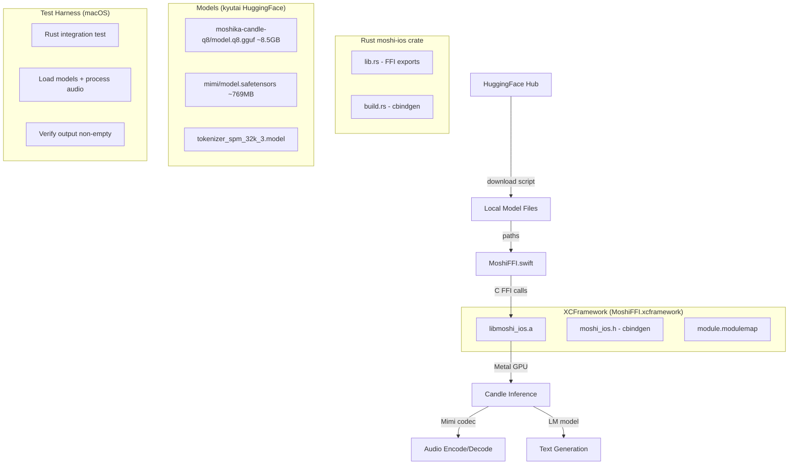
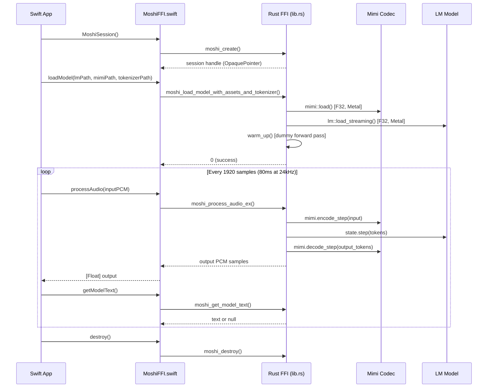

# Complete Moshi On-Device Voice Inference for iOS

## Overview

Enable fully on-device Moshi voice inference on iOS by completing the pipeline from model acquisition through verified inference. The Rust FFI layer (`rust/moshi-ios/src/lib.rs`, 601 lines, 16 C functions) and XCFramework build script (`rust/scripts/build-xcframework.sh`) already exist but the pre-built XCFramework is **stale** (header missing 5 functions). No Swift code exists yet. Models must be downloaded from HuggingFace externally since `hf-hub` is not a dependency of `moshi-ios`.

## Scope

**In scope:**
- Model download script for Mimi codec, LM (q8 GGUF), and text tokenizer from HuggingFace
- Rebuild XCFramework with updated headers and optimized binary size
- Idiomatic Swift FFI wrapper (`MoshiFFI.swift`) for all C-exported functions
- macOS test harness to verify end-to-end inference before device deployment

**Out of scope:**
- iOS app UI (AVAudioEngine integration, microphone capture, playback)
- Model fine-tuning or training
- Server-side changes
- CI/CD pipeline for automated builds
- App Store distribution or code signing

## Architecture



## Data Flow (Inference)



## Phases

### Phase 1: Model Acquisition (Task 1)
Create a download script that fetches all required model files from HuggingFace. This is independent of the build pipeline and can run on any machine.

### Phase 2: XCFramework Build (Task 2)
Rebuild the XCFramework with the current source header (all 16 functions) and optimize binary size by stripping debug symbols. Fix the stale header issue.

### Phase 3: Swift FFI Wrapper (Task 3)
Create `MoshiFFI.swift` wrapping the C API in idiomatic Swift with proper memory management, error handling, and thread safety.

### Phase 4: Verification (Task 4)
Build a macOS test harness that loads real models and verifies inference produces non-empty audio output and text tokens.

## Alternatives Considered

| Alternative | Pros | Cons | Decision |
|---|---|---|---|
| **UniFFI** for Swift bindings | Auto-generates idiomatic Swift | Adds codegen complexity, overhead inappropriate for real-time audio path | Rejected — cbindgen + manual Swift is simpler and lower-latency |
| **swift-bridge** | Swift-specific ergonomics | Smaller community, less battle-tested | Rejected — manual wrapper gives full control |
| **Bundle models in app** | Simple distribution | 8.5GB+ exceeds App Store limits | Rejected — download at runtime |
| **BF16 safetensors** instead of q8 GGUF | Higher quality | 15.8GB, loaded as F32 on Metal (doubles RAM) | Rejected — q8 is 8.5GB and practical for devices |
| **Swift test harness** (Xcode) | Tests Swift FFI directly | Requires Xcode project setup, slower iteration | Rejected for initial verification — Rust macOS test is faster to set up |

## Non-Functional Targets

- **Binary size**: XCFramework static library < 50MB per slice (currently ~128MB with debug symbols; stripping should reduce to ~30-50MB)
- **Model loading time**: < 60 seconds on iPhone 15 Pro for q8 GGUF model (warm-up included)
- **Inference latency**: < 80ms per frame (1920 samples) on Apple M-series Metal GPU
- **Peak memory**: < 6GB total (model + KV cache + audio buffers) to fit on 8GB-RAM devices
- **Frame size**: 1920 samples = 80ms at 24kHz sample rate

## Risks & Mitigations

| Risk | Likelihood | Impact | Mitigation |
|---|---|---|---|
| sentencepiece C++ cross-compilation fails for iOS target | Medium | High — blocks XCFramework build | Verify existing .a was built successfully; document CC/CXX setup if needed |
| 8.5GB q8 model exceeds iPhone RAM on 4GB devices | High | High — crash on load | Document minimum device requirement (8GB RAM, iPhone 15 Pro+) |
| Stale Metal shader compilation on first device launch | Low | Medium — slow first inference | warm_up() in load path primes shaders; document expected first-load delay |
| mmap of large model files hit iOS limits | Low | High — SIGBUS crash | Test with actual device; fall back to read-based loading if needed |
| Thread-unsafe FFI causes data races | Medium | High — UB, crashes | Swift wrapper enforces serial dispatch queue for all FFI calls |

## Rollout Plan

1. Download models to local dev machine
2. Rebuild XCFramework on macOS (developer machine)
3. Create Swift FFI wrapper as standalone .swift file
4. Verify inference on macOS via Rust test harness
5. Integrate XCFramework + Swift wrapper into iOS Xcode project (out of scope — next epic)

## Rollback

All changes are additive (new files). Rollback = delete new files:
- `rust/scripts/download-models.sh`
- Swift wrapper file
- Rebuilt XCFramework (can re-run build script)
- Test harness files

## Quick commands

```bash
# Download models
./rust/scripts/download-models.sh

# Rebuild XCFramework
./rust/scripts/build-xcframework.sh

# Run macOS test harness
cd rust && cargo test --package moshi-ios --test inference_test -- --nocapture
```

## Acceptance

- [ ] All three model files (LM q8, Mimi safetensors, tokenizer SPM) downloadable via script
- [ ] XCFramework rebuilt with all 16 C functions in header (no stale header)
- [ ] XCFramework static library size < 50MB per slice (debug symbols stripped)
- [ ] Swift FFI wrapper compiles and wraps all relevant C functions
- [ ] Swift wrapper enforces thread safety via serial dispatch queue
- [ ] macOS test harness loads models and produces non-empty inference output
- [ ] All existing Rust tests pass (`cargo test` in workspace)

## References

- Existing FFI: `rust/moshi-ios/src/lib.rs` (601 lines, 16 C functions)
- Build script: `rust/scripts/build-xcframework.sh` (96 lines)
- cbindgen config: `rust/moshi-ios/cbindgen.toml`
- Source header: `rust/moshi-ios/include/moshi_ios.h` (119 lines)
- Model repos: `kyutai/moshika-candle-q8`, `kyutai/mimi`
- Candle Metal iOS: `StorageModeShared` fix in candle 0.9.x
- CLI gen reference: `rust/moshi-cli/src/gen.rs` (file-to-file inference pattern)

## Open Questions

1. **Target device tier**: Should we document minimum 8GB RAM requirement (iPhone 15 Pro+)?
2. **HuggingFace auth**: Do the kyutai model repos require authentication tokens?
3. **Bundle identifier**: Should `ai.openclaw.MoshiFFI` in build script be changed to match kyutai-labs?
4. **User text transcription**: `moshi_get_user_text()` appears to always return null — is this a stub or a bug?
