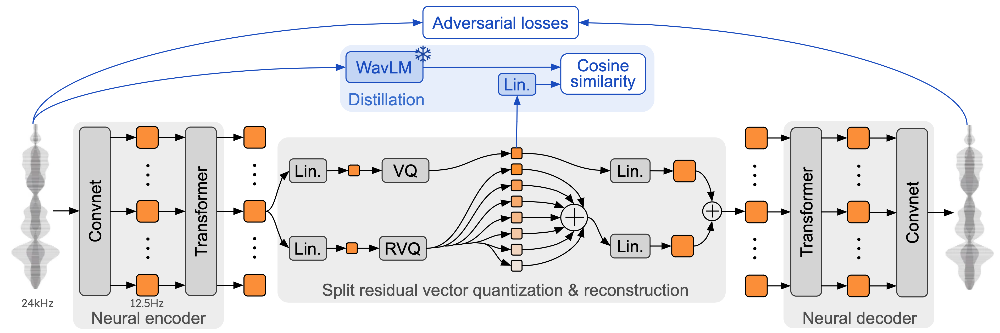

# Moshi: a speech-text foundation model for real time dialogue


[[Read the paper]][moshi] [[Demo]](https://moshi.chat) [[Hugging Face]](https://huggingface.co/collections/kyutai/moshi-v01-release-66eaeaf3302bef6bd9ad7acd)

 [Moshi][moshi] is a speech-text foundation model and **full-duplex** spoken dialogue framework.
 It uses [Mimi][moshi], a state-of-the-art streaming neural audio codec. Mimi processes 24 kHz audio, down to a 12.5 Hz representation
 with a bandwidth of 1.1 kbps, in a fully streaming manner (latency of 80ms, the frame size),
 yet performs better than existing, non-streaming, codecs like
 [SpeechTokenizer](https://github.com/ZhangXInFD/SpeechTokenizer) (50 Hz, 4kbps), or [SemantiCodec](https://github.com/haoheliu/SemantiCodec-inference) (50 Hz, 1.3kbps).

 Moshi models **two streams of audio**: one corresponds to Moshi, and the other one to the user.
 At inference, the stream from the user is taken from the audio input,
and the one for Moshi is sampled from the model's output. Along these two audio streams, Moshi predicts text tokens corresponding to its own speech, its **inner monologue**,
which greatly improves the quality of its generation. A small Depth Transformer models inter codebook dependencies for a given time step,
while a large, 7B parameter Temporal Transformer models the temporal dependencies. Moshi achieves a theoretical latency
of 160ms (80ms for the frame size of Mimi + 80ms of acoustic delay), with a practical overall latency as low as 200ms on an L4 GPU.

[Talk to Moshi](https://moshi.chat) now on our live demo.


<p align="center">
</p>

Mimi builds on previous neural audio codecs such as [SoundStream](https://arxiv.org/abs/2107.03312)
and [EnCodec](https://github.com/facebookresearch/encodec), adding a Transformer both in the encoder and decoder,
and adapting the strides to match an overall frame rate of 12.5 Hz. This allows Mimi to get closer to the
average frame rate of text tokens (~3-4 Hz), and limit the number of autoregressive steps in Moshi.
Similarly to SpeechTokenizer, Mimi uses a distillation loss so that the first codebook tokens match
a self-supervised representation from [WavLM](https://arxiv.org/abs/2110.13900), which allows modeling semantic and acoustic information with a single model. Interestingly, while Mimi is fully causal and streaming, it learns to match sufficiently well the non-causal
representation from WavLM, without introducing any delays. Finally, and similarly to [EBEN](https://arxiv.org/pdf/2210.14090),
Mimi uses **only an adversarial training loss**, along with feature matching, showing strong improvements in terms of
subjective quality despite its low bitrate.

<p align="center">
</p>


## Organisation of the repository

There are three separate versions of the moshi inference stack in this repo.
- The Python version using PyTorch is in the [`moshi/`](moshi/) directory.
- The Python version using MLX for M series Macs is in the [`moshi_mlx/`](moshi_mlx/) directory.
- The Rust version used in production is in the [`rust/`](rust/) directory.
    This contains in particular a Mimi implementation in Rust, with Python bindings available
    as `rustymimi`.

Finally, the code for the live demo is provided in the [`client/`](client/) directory.


## Models

We release three models:
- our speech codec Mimi,
- Moshi fine-tuned on a male synthetic voice (Moshiko),
- Moshi fine-tuned on a female synthetic voice (Moshika).

Depending on the backend, the file format and quantization available will vary. Here is the list
of the HuggingFace repo with each model. Mimi is bundled in each of those, and always use the same checkpoint format.

- Moshika for PyTorch (bf16): [kyutai/moshika-pytorch-bf16](https://huggingface.co/kyutai/moshika-pytorch-bf16).
- Moshiko for PyTorch (bf16): [kyutai/moshiko-pytorch-bf16](https://huggingface.co/kyutai/moshiko-pytorch-bf16).
- Moshika for MLX (int4, int8, bf16): [kyutai/moshika-mlx-q4](https://huggingface.co/kyutai/moshika-mlx-q4), [kyutai/moshika-mlx-q8](https://huggingface.co/kyutai/moshika-mlx-q8),  [kyutai/moshika-mlx-bf16](https://huggingface.co/kyutai/moshika-mlx-bf16).
- Moshiko for MLX (int4, int8, bf16): [kyutai/moshiko-mlx-q4](https://huggingface.co/kyutai/moshiko-mlx-q4), [kyutai/moshiko-mlx-q8](https://huggingface.co/kyutai/moshiko-mlx-q8),  [kyutai/moshiko-mlx-bf16](https://huggingface.co/kyutai/moshiko-mlx-bf16).
- Moshika for Rust/Candle (int8, bf16): [kyutai/moshika-candle-q8](https://huggingface.co/kyutai/moshika-candle-q8),  [kyutai/moshika-mlx-bf16](https://huggingface.co/kyutai/moshika-candle-bf16).
- Moshiko for Rust/Candle (int8, bf16): [kyutai/moshiko-candle-q8](https://huggingface.co/kyutai/moshiko-candle-q8),  [kyutai/moshiko-mlx-bf16](https://huggingface.co/kyutai/moshiko-candle-bf16).

All models are released under the CC-BY 4.0 license.

## Requirements

You will need at least Python 3.10, with 3.12 recommended. For specific requirements, please check the individual backends
directories. You can install the PyTorch and MLX clients with the following:

```bash
pip install moshi      # moshi PyTorch, from PyPI
pip install moshi_mlx  # moshi MLX, from PyPI, best with Python 3.12.
# Or the bleeding edge versions for Moshi and Moshi-MLX.
pip install -e "git+https://git@github.com/kyutai-labs/moshi.git#egg=moshi&subdirectory=moshi"
pip install -e "git+https://git@github.com/kyutai-labs/moshi.git#egg=moshi_mlx&subdirectory=moshi_mlx"

pip install rustymimi  # mimi, rust implementation with Python bindings from PyPI
```

If you are not using Python 3.12, you might get an error when installing
`moshi_mlx` or `rustymimi` (which `moshi_mlx` depends on). Then, you will need to install the [Rust toolchain](https://rustup.rs/), or switch to Python 3.12.

While we hope that the present codebase will work on Windows, we do not provide official support for it.
We have tested the MLX version on a MacBook Pro M3. At the moment, we do not support quantization
for the PyTorch version, so you will need a GPU with a significant amount of memory (24GB).

For using the Rust backend, you will need a recent version of the [Rust toolchain](https://rustup.rs/).
To compile GPU support, you will also need the [CUDA](https://developer.nvidia.com/cuda-toolkit) properly installed for your GPU, in particular with `nvcc`.

## Python (PyTorch)

The PyTorch based API can be found in the `moshi` directory. It provides a streaming
version of the audio tokenizer (mimi) and the language model (moshi).

In order to run in interactive mode, you need to start a server which will
run the model, you can then use either the web UI or a command line client.

Start the server with:
```bash
python -m moshi.server [--gradio-tunnel] [--hf-repo kyutai/moshika-pytorch-bf16]
```

And then access the web UI on [localhost:8998](http://localhost:8998).
If your GPU is on a distant machine this will not work as websites using http
are not allowed to use the audio worklet api. There are two ways to get around
this:
- Forward the remote 8998 port to your localhost using ssh `-L` flag. Then
  connects to [localhost:8998](http://localhost:8998) as mentionned previously.
- Use the `--gradio-tunnel` argument, this sets up a tunnel with a URL accessible from anywhere.
  Keep in mind that this tunnel goes through the US and can add significant
  latency (up to 500ms from Europe). You can use `--gradio-tunnel-token` to set a
  fixed secret token and reuse the same address over time.

You can use `--hf-repo` to select a different pretrained model, by setting the proper Hugging Face repository.

Accessing a server that is not localhost via http may cause issues with using
the microphone in the web UI (in some browsers this is only allowed using
https).

A local client is also available, as
```bash
python -m moshi.client [--url URL_TO_GRADIO]
```
However note that, unlike the web browser, this client is barebone: it does not perform any echo cancellation,
nor does it try to compensate for a growing lag by skipping frames.

For more information, in particular on how to use the API directly, please
checkout [moshi/README.md](moshi/README.md).

## Python (MLX) for local inference on macOS

Once you have installed `moshi_mlx`, you can run
```bash
python -m moshi_mlx.local -q 4   # weights quantized to 4 bits
python -m moshi_mlx.local -q 8   # weights quantized to 8 bits
# And using a different pretrained model:
python -m moshi_mlx.local -q 4 --hf-repo kyutai/moshika-mlx-q4
python -m moshi_mlx.local -q 8 --hf-repo kyutai/moshika-mlx-q8
# be careful to always match the `-q` and `--hf-repo` flag.
```

This command line interface is also barebone. It does not perform any echo cancellation,
nor does it try to compensate for a growing lag by skipping frames.

Alternatively you can run `python -m moshi_mlx.local_web` to use
the web UI, the connection is via http and will be at [localhost:8998](http://localhost:8998).

## Rust

In order to run the Rust inference server, use the following command from within
the `rust` directory:

```bash
cargo run --features cuda --bin moshi-backend -r -- --config moshi-backend/config.json standalone
```

When using macOS, you can replace `--features cuda` with `--features metal`.

Alternatively you can use `config-q8.json` rather than `config.json` to use the
quantized q8 model. You can select a different pretrained model, e.g. Moshika,
by changing the `"hf_repo"` key in either file.

Once the server has printed 'standalone worker listening', you can use the web
UI. By default the Rust server uses https so it will be at
[localhost:8998](https://localhost:8998).

You will get warnings about the site being unsafe. When using chrome you
can bypass these by selecting "Details" or "Advanced", then "Visit this unsafe
site" or "Proceed to localhost (unsafe)".

## Clients

We recommend using the web UI as it provides additional echo cancellation that helps
the overall model quality. Note that most commands will directly serve this UI
in the provided URL, and there is in general nothing more to do.

Alternatively, we provide command line interfaces
for the Rust and Python versions, the protocol is the same as with the web UI so
there is nothing to change on the server side.

For reference, here is the list of clients for Moshi.

### Rust Command Line

From within the `rust` directory, run the following:
```bash
cargo run --bin moshi-cli -r -- tui --host localhost
```

### Python with PyTorch

```bash
python -m moshi.client
```

### Docker Compose (CUDA only)

```bash
docker compose up
```

* Requires [NVIDIA Container Toolkit](https://docs.nvidia.com/datacenter/cloud-native/container-toolkit/latest/install-guide.html)

### WebUI

The web UI can be built from this repo via the
following steps (these will require `npm` being installed).
```bash
cd client
npm install
npm run build
```

The web UI can then be found in the `client/dist` directory.

## Development

If you wish to install from a clone of this repository, maybe to further develop Moshi, you can do the following:
```bash
# From the root of the clone of the repo
pip install -e 'moshi[dev]'
pip install -e 'moshi_mlx[dev]'
pre-commit install
```

If you wish to build locally `rustymimi` (assuming you have Rust properly installed):
```bash
pip install maturin
maturin dev -r -m rust/mimi-pyo3/Cargo.toml
```

## FAQ

Checkout the [Frequently Asked Questions](FAQ.md) section before opening an issue.


## License

The present code is provided under the MIT license for the Python parts, and Apache license for the Rust backend.
The web client code is provided under the MIT license.
Note that parts of this code is based on [AudioCraft](https://github.com/facebookresearch/audiocraft), released under
the MIT license.

The weights for the models are released under the CC-BY 4.0 license.

## Citation

If you use either Mimi or Moshi, please cite the following paper,

```
@techreport{kyutai2024moshi,
      title={Moshi: a speech-text foundation model for real-time dialogue},
      author={Alexandre D\'efossez and Laurent Mazar\'e and Manu Orsini and
      Am\'elie Royer and Patrick P\'erez and Herv\'e J\'egou and Edouard Grave and Neil Zeghidour},
      year={2024},
      eprint={2410.00037},
      archivePrefix={arXiv},
      primaryClass={eess.AS},
      url={https://arxiv.org/abs/2410.00037},
}
```

[moshi]: https://arxiv.org/abs/2410.00037
